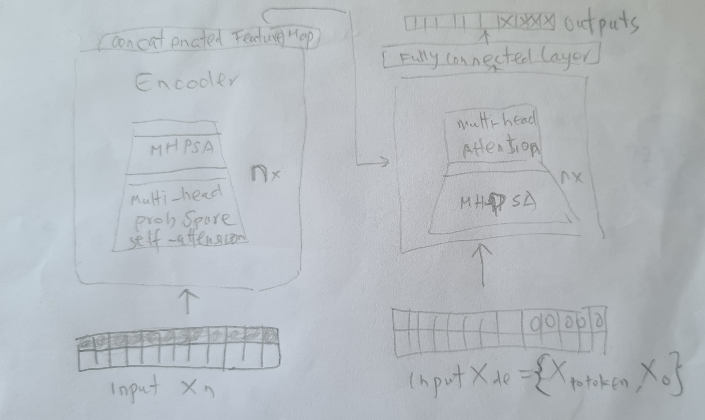
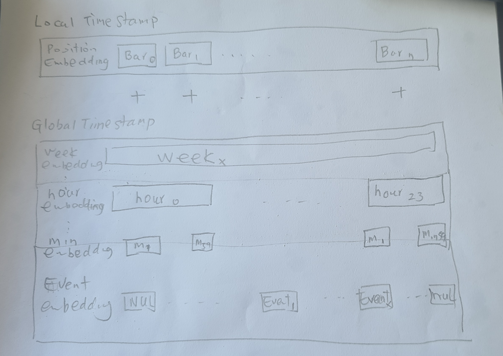

# Plan
本计划包括两个部分：
1. Tradingformer （一个基于transformer的对市场价格预测的模型）
2. MDRL （model based 的Deep Re-enforcement Learning，policy是用Tradingformer 提供，以便于更好的收益和更快的学习）
3. 利用 1. 的完成 可以进一步在TradingGym环境中利用MDRL强化学习， 创建更高效，准确和低回撤的交易model
4. 

# Tradingformer

## 背景

### 关于BAR

交易价格（trading price）在一段时间内可以浓缩为一个bar（比如常用的candlestick）本文用bar来表述这一概念。Bar应该是一种即包含着价格随机变动，有存在一定规律（比如趋势）的信息。所以我们要用一个向量去映射出来Bar的信息，我们可以做bar2vec的转换。

Candlestick是浓缩了一段时间内价格变化的，只给出了这个时间段的价格四个基本表征（open，close，high，low)，不包括价格在这段时间内的分布状态，
可以考虑在bar pre-process 时候做一个bar的正态分布的指标值，加如价格在时间段内的形态分布表征，虽然这一信息对图形分析用处不大，但可能对机器学习有很大用处，

在一段时间内的一系列bar（与时间单位无关）就是这段时间内价格变化的表述，也就是价格变化的语言。但与NLP不同的是，序列的bar不是每一个都有意义，很大一部分的bar并没有价格趋势的表征，或者表征是完全淹没在噪音中， 特别是当bar的时间单位越小，其随机变动（即 白噪音）的成分和比重就越大，我们都知道噪音是随机的，不可预测的。所以在小的时间单位，只有剧烈的，明显的价格趋势的变动特征信号才有意义，这样可能对于基于1min与5min的model，5min可能效果更好，因为其价格趋势表征更为突出。即便如此，这样在价格变动的特征空间中映射的效应也是一个long tail。即大多数的bar的特征空间映射值是被淹没在噪声中，没有可预测性的。只有long tail的head部分才能为价格提供预测的支持。这就是为什么我们做encoding/decoding考虑用 Probability Sparse Self-Attention。

### Trading Market

从market的角度来说，什么是价格变化的推动力，为什么价格要变化？价格理论认为:

    ①市场的行为包含一切信息
    ②价格沿趋势移动
    ③历史会重复

如果价格理论是正确的，那么根据第②，③条，价格沿趋势移动，可以理解为，价格在一定的时间段内是有趋势的，是可以预测的。市场的行为也可以看成价格的变动。而第①条，推动价格变化的信息包括如下主要几项：
1. 买，卖双方对市场价格的判定，（银行，机构，做市商）
2. 新闻（利率变化，经济展望...)，突发事件。
3. 季节和大的经济周期

单独的bar序列仅仅反映的价格的变化，没有包括在价格变化的动力，而且最重要的价格动力之一（第1.条）也是没有明确的信息可以量化和引入的。这就说明我们的预测是在一个信息不对称，不全面的基础上。为增加预测的可靠性，应该尽量把大部分的第2.和3.的信息包括在历史数据和未来预测数据中，具体的就是在时间维度上增加更多的信息，比如（hour，day，day of week，day of month，month，year，which market，news）

## Tradingformer

### 背景
Transformer 在NLP （BERT,GPT) 和 CV （ViTx）方面的进展是有目共睹的，而且model做的越来越大 （TB级别的参数），但在这两个领域仍然没有overfit的情况。说明transformer有很强的robustness。

那么可以不可以把transformer应用到trading market上，利用各种市场的历史数据（股票，forex，crypto）来建模，这样应该有足够大的数据量来产生一个良好的模型，然后针对特定时间段的，特定某个个股或trading pair进行微调，我们是不是可以预期得到比其他方法（LSTM，技术分析，基础面分析）更好的预测结果的。

### 模型

考虑的bar的the long tail distribution in self-attention feature map的特征，encoding 可以multi-head probSparse self-attention。这样可以减少memory 和运算的开销。但采用transformer original encoding 应该也是可以的

### Input Pre-process

#### Bar 预处理
1. 长度 (day) 
相当月NLP句子的长度，不可以太长，维度增加（**2）， 用自然的天是一个理想的分割

2. Max bar in one day 

| 时间 | 信息|噪音|bar|长度|
| --- | --- | --- | --- | --- |
|1 min  |损失小| 高 | 60 X 24 = 1440 | 大 |
|5 min  |损失小| 合理 | 288 | 合理 |
|15 min  |损失大| 合理 | 96 |合理 |
|1 hour  |损失大| 低 | 24 | 小 |

Bar 5min 信息损失小，噪音低， 长度合理

#### bar的编码设计 （改进中）

    [stock_name][r_bar[0]]...[r_bar[n]]

使用价格的相对值，这样让bar的信息有更多的普遍性

    r_bar[open,high,low,close][n] = bar[open-open_price,high-open_price,low-open_price,close-open_price][n]/open_price

进一步，对bar 需要 

    de-noise
    normalization
    similarity 
    tokenize

这样创建bar vocab 与绝对价格无关, 通过上述的步骤（de-noise，normalization，similarity） 可以产生相对小的数集（token）

绝对价格表示 

    bar[n] = norm(bar[n][open_price],daily[high,low])

#### positional （The Uniform Input Representation）

Local Time Stamp 

    bar[0]，...,bar[n]

Global Time Stamp （可学习）

    由于所以的时间事件在一天中可以表示成为统一的limited vocab size （如果 taking minute or （5 min） as the finest granularity）

